### Olá, sou o Vasco 👋

Fullstack Developer júnior, formado em Desenvolvimento Web e Dispositivos Móveis (CTeSP, ESTG/IPP). Gosto de aprender fazendo e de construir projetos completos, do frontend ao backend.

**Em produção, na Fashable**, trabalhei em dois projetos reais:
- Módulo de geração/edição de imagem com IA (geração por texto, edição com máscara)
- Funcionalidade de catalogação e venda de vestuário com distribuição automática para redes sociais e checkout via Stripe

#### 🛠️ Stack
`JavaScript` `TypeScript` `Python` `Kotlin` `Swift` `Lua` · `React` `Next.js` `Tailwind CSS` `UIKit` · `FastAPI` `Node.js` `Express` · `MongoDB` `Cosmos DB` `Core Data` · `Microsoft Azure` · `Git`

#### 📌 Projetos em destaque
- **SmartLibrary Hub**: plataforma full-stack de gestão de biblioteca (Node.js, Express, MongoDB, React 18), com autenticação JWT, controlo de acessos por perfil, gestão de empréstimos, multas e reservas de espaços.
- **AdotaPet**: app iOS de adoção de animais (Swift, UIKit, Core Data), com mapa interativo, gamificação e integrações nativas (SMS, Contactos, chamadas).
- **ClimaApp**: app Android de monitorização meteorológica (Kotlin, Jetpack Compose, arquitetura MVVM, API Open-Meteo).
- **Fifty Bird**: jogo 2D em Lua com LÖVE (Love2D), inspirado no Flappy Bird, com vários níveis de dificuldade e personalização de nível. Projeto da Prova de Aptidão Profissional (PAP).

#### 📫 Contacto
[LinkedIn](https://www.linkedin.com/in/vasco-rodrigues-521b983aa) · rvasco341@gmail.com

# SmartLibrary Hub

Plataforma full-stack de gestão de biblioteca, desenvolvida no âmbito da unidade curricular de Programação para a Web.

## ✨ Funcionalidades
- Autenticação e autorização com JWT
- Controlo de acessos por perfil (RBAC): administrador, funcionário, utilizador
- Gestão de empréstimos e devoluções de livros
- Cálculo e gestão de multas por atraso
- Reserva de espaços (salas de estudo)

## 🛠️ Stack técnica
- **Frontend:** React 18
- **Backend:** Node.js, Express
- **Base de dados:** MongoDB
- **Autenticação:** JWT

## 📚 Contexto académico
Projeto desenvolvido para a unidade curricular de Programação para a Web, no CTeSP de Programação para Web e Dispositivos Móveis (ESTG/IPP).

# ClimaApp

Aplicação Android de monitorização meteorológica, desenvolvida no âmbito da unidade curricular de Programação para Dispositivos Móveis 1.

## ✨ Funcionalidades
- Consulta de condições meteorológicas atuais e previsão
- Interface construída com Jetpack Compose
- Persistência local de preferências e última localização consultada

## 🛠️ Stack técnica
- **Linguagem:** Kotlin
- **UI:** Jetpack Compose
- **Arquitetura:** MVVM
- **API externa:** Open-Meteo
- **Persistência local:** SharedPreferences + Gson

## 📚 Contexto académico
Projeto desenvolvido para a unidade curricular de Programação para Dispositivos Móveis 1, no CTeSP de Programação para Web e Dispositivos Móveis (ESTG/IPP).

# AdotaPet

Aplicação iOS de adoção de animais de estimação, desenvolvida na unidade curricular de Programação para Dispositivos Móveis II.

## ✨ Funcionalidades
- Listagem de animais disponíveis para adoção, com filtros por categoria (Cães, Gatos, Todos) e pesquisa por nome
- Ficha de detalhe completa de cada animal, com fotos, descrição e características
- Sistema de favoritos, persistido localmente com Core Data
- Mapa interativo com localização dos animais e filtros por raio de distância (5km, 10km, 50km), usando CoreLocation e MapKit
- Sistema de gamificação com conquistas desbloqueadas por marcos de utilização
- Integração nativa com iOS: envio de SMS pré-preenchido, chamadas telefónicas e gravação de contacto do abrigo na agenda
- Notificações locais diárias a sugerir um animal para adoção
- Definições configuráveis: tema claro/escuro, hora da notificação e número de animais por página

## 🛠️ Stack técnica
- **Linguagem:** Swift 5.0+
- **Interface:** UIKit (ViewCode e Auto Layout, sem Storyboards)
- **Persistência:** Core Data
- **Localização:** CoreLocation, MapKit
- **Integração de sistema:** UserNotifications, MessageUI, Contacts
- **Arquitetura:** MVC (Model-View-Controller)

## 📸 Screenshots

| Ecrã Principal | Detalhe do Animal |
|---|---|
| 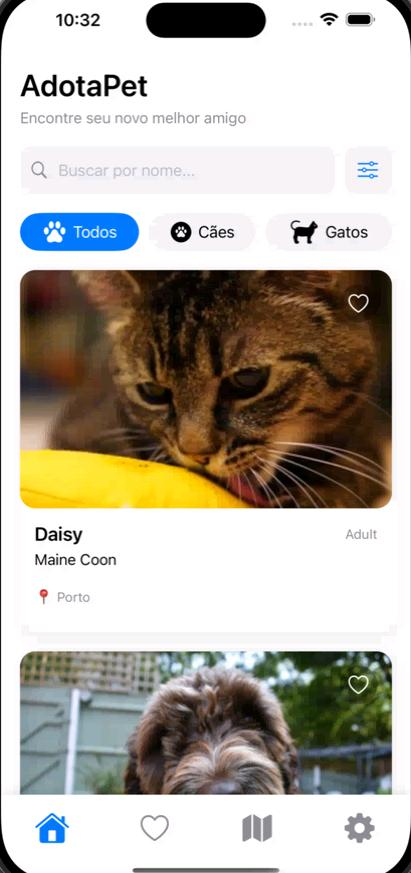 | 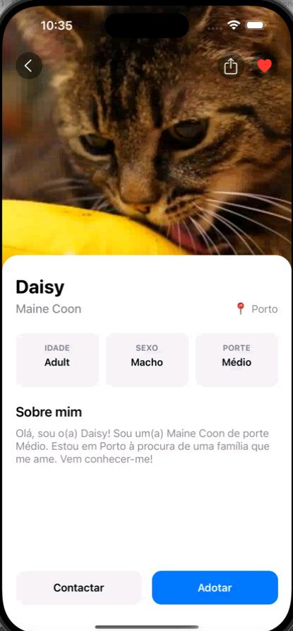 |

| Mapa | Favoritos |
|---|---|
| 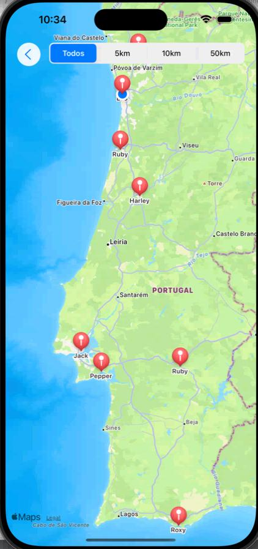 | 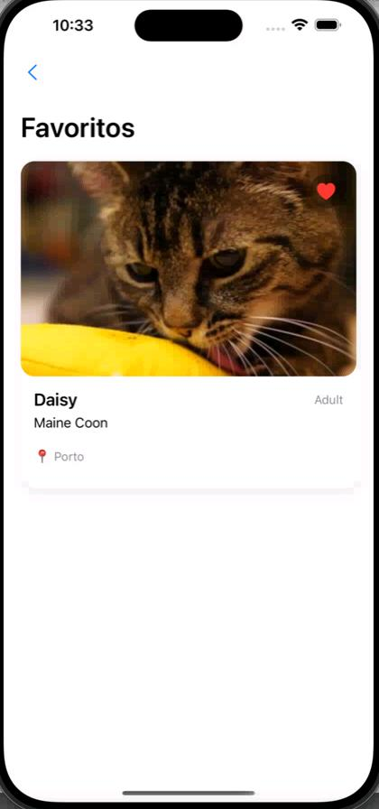 |

| Definições |
|---|
| 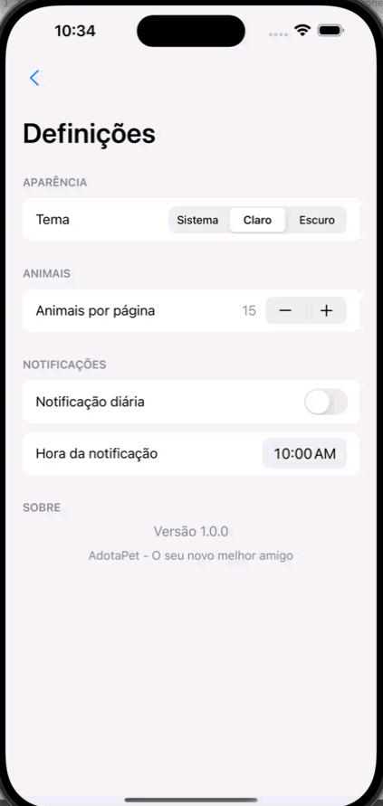 |

## 📚 Contexto académico
Projeto desenvolvido para a unidade curricular de Programação para Dispositivos Móveis II, no CTeSP de Programação para Web e Dispositivos Móveis (ESTG/IPP).

# Fifty Bird

Jogo 2D em Lua inspirado no Flappy Bird, desenvolvido como Prova de Aptidão Profissional (PAP) do Curso Profissional de Programador Informático.

## ✨ Funcionalidades
- Jogabilidade 2D estilo "flappy", com física simples de gravidade e salto
- Seleção de níveis: clássicos, diferenciados e nível original
- Dificuldade personalizada, com ajuste de velocidade e espaçamento dos obstáculos
- Menu de pausa com acesso a controlos, seleção de nível e saída
- Contagem de pontuação em tempo real

## 🛠️ Stack técnica
- **Linguagem:** Lua
- **Framework:** LÖVE (Love2D)

## 📸 Screenshots

| Menu principal | Seleção de níveis |
|---|---|
| 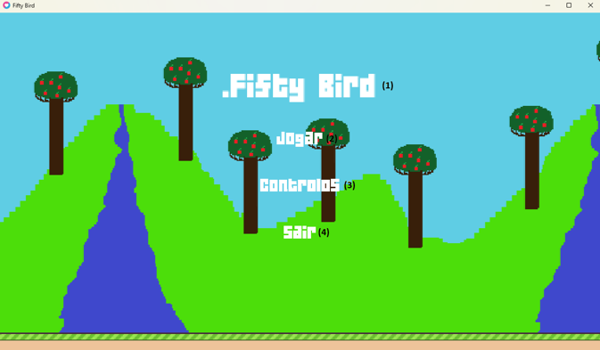 | 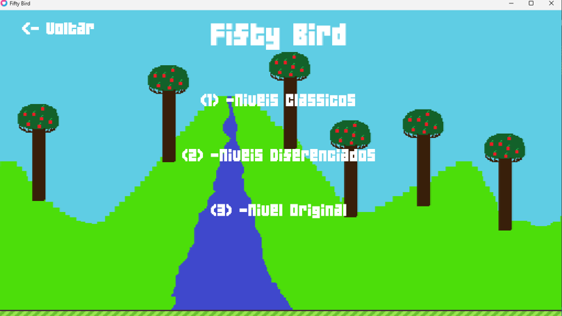 |

| Dificuldade personalizada | Pausa |
|---|---|
| 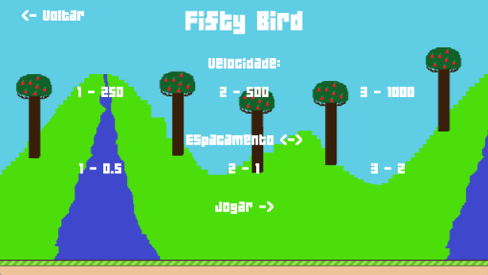 | 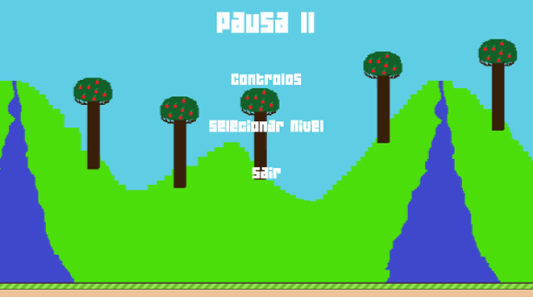 |

| Gameplay |
|---|
| 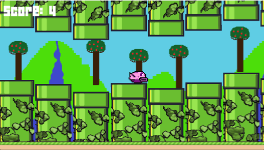 |
| 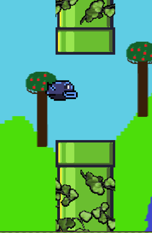 |

## 📚 Contexto académico
Projeto desenvolvido como Prova de Aptidão Profissional (PAP), no Curso Profissional de Programador Informático.
